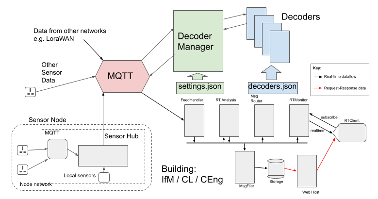

# ACP MQTT Decoder Framework



## Requirement

We're using multiple sensor *types* providing real-time data to the ACP platform and need
a 'plugin' framework to permit the dynamic addition of sensor data decoders. This is necessary
because our MQTT broker receives data from multiple sources each using their own formats for the
MQTT messages and new sensors are constantly being added to the system.

## Approach

A decoder can be added *dynamically* by:
1. putting the source file into the `decoders` directory,
2. editting the `decoders.json` file to add the name of the new decoder,
3. sending signal SIGALRM to the running DecoderManager

i.e. the main process does not need to be stopped for additional decoders
to be added. This is to support a typical IoT environment where new sensor types are added to the network
with a data format not compatible with existing decoders for that network.

This project is a combination of using the asyncio `gmqtt` client to subscribe to
an MQTT broker where each message may need decoding (or parsing) to produce a more readable version for subsequent
processing. The decoded version of the message may be published back into an MQTT broker so other clients can
use the same method to subscribe to those (or the main python process can simply process the message directly).

In part we are compensating for limitations in the TTN (The Things Network) decoder support, where a destination
'application' is limited to a single Javascript 'decode' function which becomes unwieldy when multiple sensor types are
to be supported.
As a minimum, the decoder plugins will read the raw sensor data and output an enhanced payload including:
* `acp_id`: the identifier of the sensor
* `acp_ts`: the UTC timestamp *including optional decimal fractions of a second* as a STRING.

We are using JSON as the generic data format, and BOTH the `acp_id` and `acp_ts` properties will be
defined as STRING values.

## Contributors

* Ian Lewis
* Justas Brazauskas
* Rohit Verma

## Install

If necessary installl python venv module with:
```
sudo apt install python3-venv
```

As `acp_prod` user:
```
cd ~acp_prod/acp_local_mqtt/acp_decoders
python3 -m venv venv
source venv/bin/activate
python3 -m pip install pip --upgrade
python3 -m pip install wheel
python3 -m pip install -r requirements.txt
```

**confirm file `acp_local_mqtt/secrets/settings.json` exists (from acp_local_mqtt install)**

To run on reboot:
```
crontab -e

@reboot /home/acp_prod/acp_local_mqtt/run.sh
```

Start the decoders with:
```
/home/acp_prod/acp_local_mqtt/run.sh
```

Check the running status of the local MQTT broker `mosquitto` and `acp_decoders`:
```
/home/acp_prod/acp_local_mqtt/status.sh
```

## Configuration

The configuration settings for `acp_decoders` are in the file:
```
acp_local_mqtt/secrets/settings.json
```

E.g.
```
{
    "decoders_file": "decoders.json",

    "decoded_property": "payload_cooked",

    "input_mqtt": { "user": "<input mqtt user>",
                    "password": "<input mqtt password>",
                    "host": "localhost",
                    "port": 1883,
                    "topic": "#"
                  },
    "output_mqtt": { "user": "<output mqtt user>",
                    "password": "<output mqtt password>",
                    "host": "localhost",
                    "port": 1883,
                    "topic_prefix": "acp/"
                  }
}
```

## Run

```
nohup /home/acp_prod/acp_local_mqtt/acp_decoders/run.sh &
```

`acp_decoders` will log to `/var/log/acp_prod/acp_decoders.log` and `acp_decoders.err`.

## Signal handling

### Terminate

The program will terminate cleanly with
```
kill <pid>
```
`acp_local_mqtt/acp_decoders/exit.sh` is a script which does this.

### Reload decoders

The program will reload its decoders (from `decoders.json`) with:
```
kill -SIGALRM <pid>
```
`acp_local_mqtt/acp_decoders/reload.sh` is a script which does this.

The pid can be found interactively with `ps aux | grep acp_mqtt_decoders`

## Outline program structure

This project uses 'importlib' to create a basic python 'plugin' capability, dynamically loading
Python modules from a sub-directory. The main program then uses the modules to process incoming data.

If the 'internal' decoder lookup mechanism fails, the framework will call each of the `test(msg)`
methods of the plugin decoders until one returns True, in which case that decoder will be
used to decode the message.

If none of the plugin decoders return True, then a generic 'passthrough' decoder will be used,
which may add properties to the message such as `acp_ts`.

## Decoder design

Decoders are written as Python class files defining the "Decoder" class.

The class will have two public methods:

* `test(topic, msg_bytes)` : return True if this Decoder should decode this message.

* `decode(topic, msg_bytes)`: return a decoded version of the message.

## Typical use cases

### The Things Network (LoraWAN)

When LoraWAN sensor data arrives that the TTN network server (The Things Network), TTN will package the sensor data
into a JsonObject, with the actual data bytes base64-encoded in a `payload_raw` property. `python_decoders` will
subscribe to these messages, pass the full message to each decoder in the 'decoders' directory, and *one* decoder will
interpret the `payload_raw` property and return a new JsonObject with the data from that property transformed into
more easily usable (and readable) Json properties.

Incoming topic:
```
cambridge-sensor-network/devices/<dev_id>/up
```

Incoming message (converted from bytes to utf-8):
```
{
  "app_id": "cambridge-sensor-network",
  "dev_id": "adeunis-test-3",
  "hardware_serial": "0018B200000218CD",
  "port": 218,
  "counter": 250,
  "confirmed": true,
  "payload_raw": "nxlSEzNwAACAQBZJOw2UcgE=",
  "payload_fields": {
    "battery": 3.476,
    "device": "adeunis_test",
    "downlink_counter": 59,
    "gps_reception": 1,
    "gps_satellites": 6,
    "latitude": 52.22228333333333,
    "longitude": 0.13399999999999998,
    "rssi": -114,
    "snr": 1,
    "temperature": 25,
    "uplink_counter": 73
  },
  "metadata": {
    "time": "2020-03-28T15:46:40.911652562Z",
    "frequency": 867.9,
    "modulation": "LORA",
    "data_rate": "SF12BW125",
    "airtime": 1646592000,
    "coding_rate": "4/5",
    "gateways": [
      {
        "gtw_id": "csn-mtcdtip-003b02",
        "gtw_trusted": true,
        "timestamp": 3881999260,
        "time": "2020-03-28T15:46:40Z",
        "channel": 7,
        "rssi": -123,
        "snr": -10,
        "rf_chain": 0,
        "latitude": 52.20508,
        "longitude": 0.10830272,
        "altitude": 48,
        "location_source": "registry"
      }
    ]
  }
}
```

### Tasmota smartplugs

Our smartplugs have been flashed with the [Tasmota](https://tasmota.github.io/docs/#/) firmware which supports sending
the smartplug energy readings as a JSON-format message to an MQTT broker.

However, Tasmota does not directly provide a way of including the 'id' of the smartplug in its actual message. Frankly this
a rather unexpected oversight. Instead, the id is encoded into the MQTT *topic* which is customizable. We have standardized
upon a topic format adding a `csn/` prefix to the MQTT topic and placing the sensor id second:
```
csn/<sensor_id>/<other Tasmota labels>
```
For example for smartplug `tas-power-12345` the periodic (and threshold-based) energy readings are published on the MQTT topic:
```
csn/tas-power-12345/tele/SENSOR
```

The message also contains the full topic, as below (using our configuration with a prefix):
```
{ "Time": "2020-02-04T00:00:54",
  "ENERGY": { "TotalStartTime": "2019-12-28T13:06:02",
              "Total": 2.617,
              "Yesterday": 0.163,
              "Today": 0.0,
              "Period": 0,
              "Power": 1,
              "ApparentPower": 8,
              "ReactivePower": 8,
              "Factor": 0.16,
              "Voltage": 243,
              "Current": 0.035
            },
    "topic": "csn/tas-power-12345/tele/SENSOR"
}
```
Our decoder for these devices extracts the `tas-power-12345` from the MQTT topic and injects new properties into the message:
```
"acp_id": "tas-power-12345",
"acp_ts": "1585407064.456337",
```
